# 00 Setting

---------------

## このスライドについて

## キーバインド

    h   -> ヘルプ
    t   -> 目次
    ESC -> スライド一覧
    2   -> ノート

---------------

# 開発環境を作ろう

---------------

## 注意

バージョン違いは気にしないで下さい。最新版でOKです。

---------------

## 1. ASRuby-1.8.7-p330 のインストール

## ActiveScriptRubyのインストール

1. 下記サイトの**「ActiveScriptRuby 1.8.7-p302 を用いた Ruby バージョン 1.8.7-p302 のインストール」**を行います。(最新版はバージョンが異なります)
   **「Ruby on Railsのインストール」**はまだ行わないので注意して下さい。

[http://kkaneko.com/rinkou/ruby/activescriptrubyinstallwindows.html](http://kkaneko.com/rinkou/ruby/activescriptrubyinstallwindows.html)

## パスを通す

環境変数PATHに、**_${rubyのインストール先}_\\bin** を追加します。
(例: C:\\Program Files(x86)\\ruby-1.8\\bin)

下記のサイトに手順が載っているので、参考にしてください。

[http://openlab.jp/fumio/windows_environment_variable_ja.html](http://openlab.jp/fumio/windows_environment_variable_ja.html)

---------------

## 2. SQLite3 DLL版のインストール

## 手順

[http://www.dbonline.jp/sqliteinstall/install/index3.html](http://www.dbonline.jp/sqliteinstall/install/index3.html)

上記サイトの手順でインストールを行なって下さい。

## 注意

コピー先は、**_${rubyのインストール先}_\\bin** を推奨します。任意のディレクトリにコピーし、パスを通す方法でも良いです。

---------------

## 3. Ruby on Rails2のインストール

## コンソールの起動

rubyコンソールからインストールをします。
Windows の「スタート」から「Ruby 1.8」を選び，ruby console(administrator)を起動して下さい。

## インストール

以下のコマンドでインストールを行います。
一行目は学校内でインストールを行う場合のみ打ち込んで下さい。

    !bash
    $ set http_proxy=http://wwwproxy.kanazawa-it.ac.jp:8080 (学校内で行う場合のプロキシ設定)

    $ gem update --system
    $ gem install sqlite3
    $ gem install rails -v 2.3.11

---------------

## 4. Eclipse3.5(Galileo)のインストール

### ダウンロード先

[http://mergedoc.sourceforge.jp/index.html#/pleiades_distros3.5.html](http://mergedoc.sourceforge.jp/index.html#/pleiades_distros3.5.html)

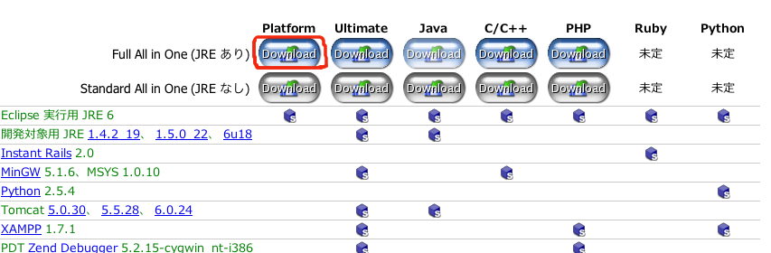

### 手順

    1. ダウンロードしたpleiades-e3.5-platform-jre_20100226.zipを解凍します。
    2. pleiades-e3.5-platform-jre_20100226ディレクトリを任意の場所(インストール先)にコピーします。
       この時コピー先のパスに日本語が含まれないようにして下さい。
    3. pleiades-e3.5-platform-jre_20100226.zip\eclipse.exeのショートカットを作っておくと便利です。

---------------

## 5-1. RadRailsのインストール

    1. Eclipseを起動します。ワークスペースの選択ダイアログが出ます。
       ここにプロジェクトファイルが保存されるので、好きな場所を選択して下さい。
       ただし、パスに日本語が含まれないようにしてください。
    2. [ヘルプ]から[新規ソフトウェアのインストール]を選択します。

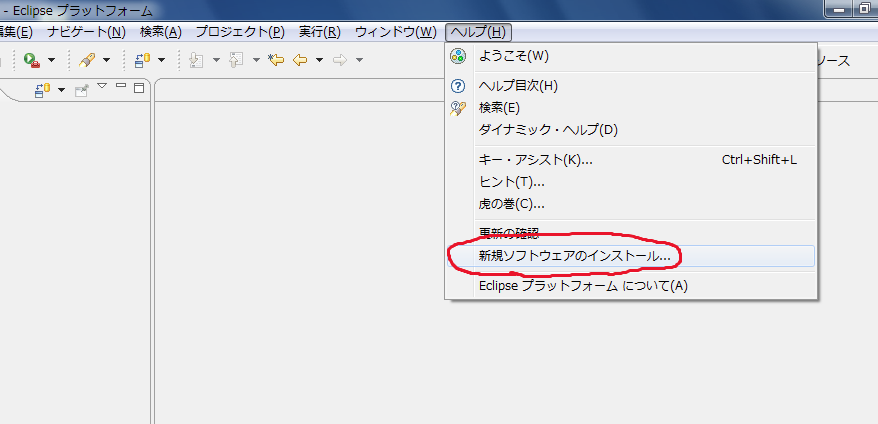

---------------

## 5-2. RadRailsのインストール

    3. 作業対象に http://download.aptana.com/studio3/plugin/install を入力します。
    4. Aptana Studio3にチェックを入れて次へ。

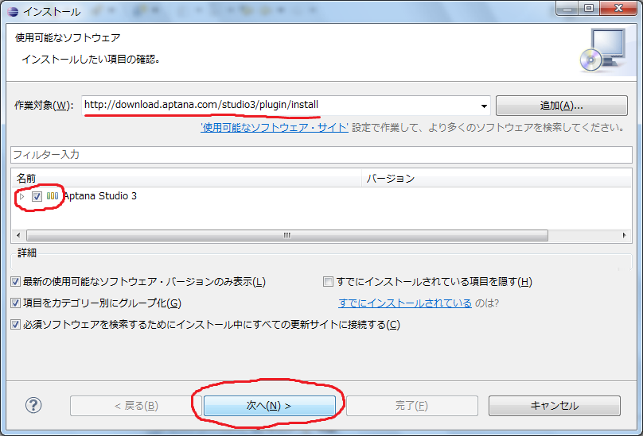

---------------

## 5-3. RadRailsのインストール

    5. 完了をクリックします。

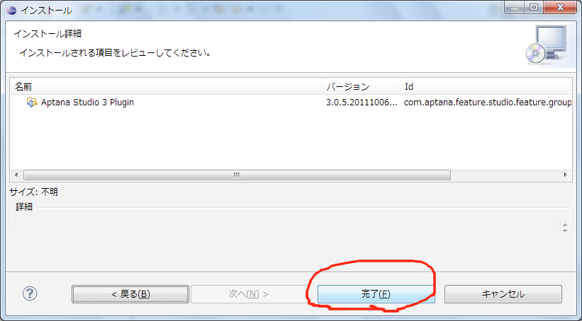

---------------

## 5-4. RadRailsのインストール

    6. インストールが開始され、プログレスバーがウィンドウ右下に
       表示されます。(表示が小さいので注意して下さい)
    7. インストールが完了すると再起動を促されるので、再起動を行います。
    8. 再起動が完了すると、Gitが見つからない旨が表示されます。
       「Use ProtableGit」をクリックし、Gitのインストールを行います。

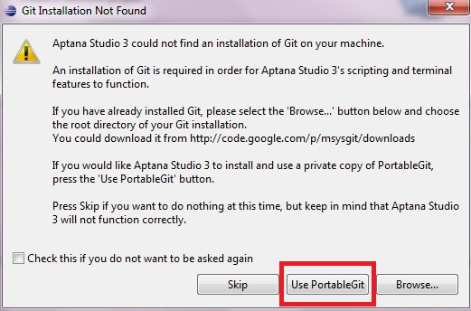

---------------

## 5-5. RadRailsのインストール

    9. JavascriptのデバッグのためにFirefoxをインストールする
       というダイアログが表示されます。これをキャンセルします。

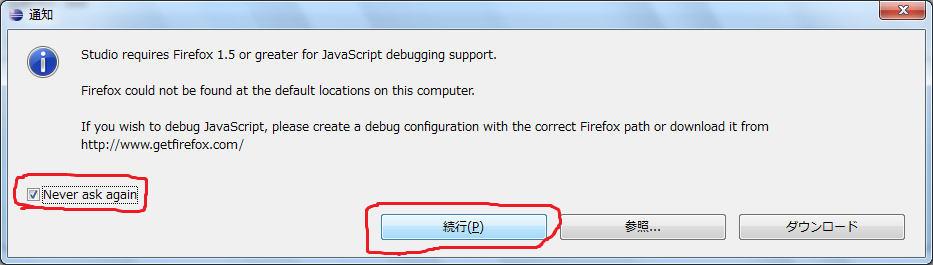

## インストール完了です!!

---------------

# Rubyのプログラムを動かしてみよう

---------------

## 1-1. プロジェクトの作成

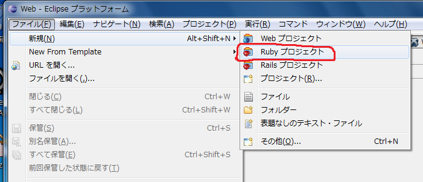

メニューの「ファイル」ー＞「新規」ー＞「Rubyプロジェクト」を選択します。

---------------

## 1-2. プロジェクトの作成

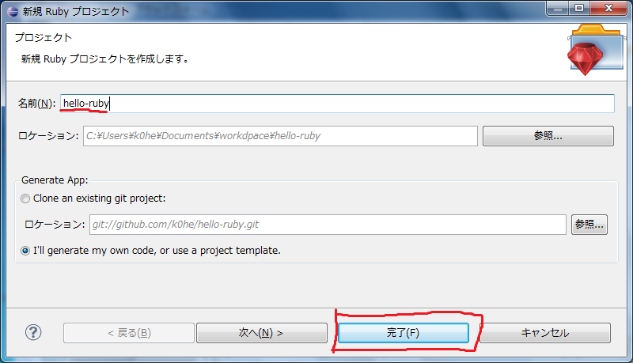

プロジェクト名を入力し、完了をクリックします。

---------------

## 1-3. プロジェクトの作成

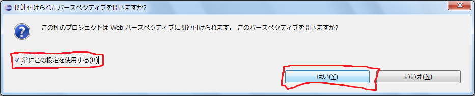

ダイアログが表示されるので、上記画像のようにチェックボックスにチェックを入れ、「はい」を押します。

---------------

## 2-1. ソースファイルの追加

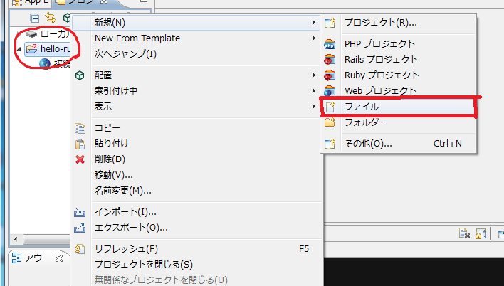

プロジェクトフォルダを右クリックし、「新規」ー＞「ファイル」を選択します。

---------------

## 2-2. ソースファイルの追加

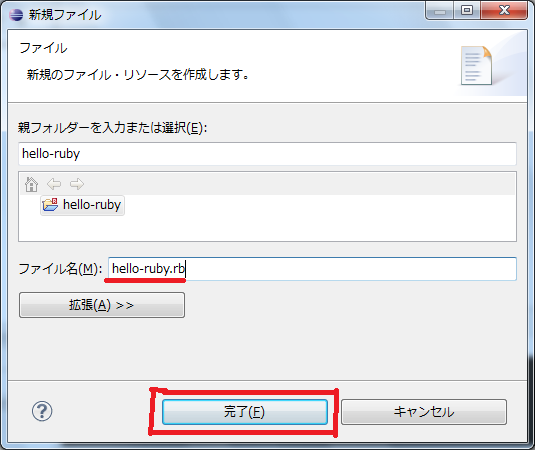

ファイル名を入力し、完了をクリックします。

---------------

## 3. 実行する

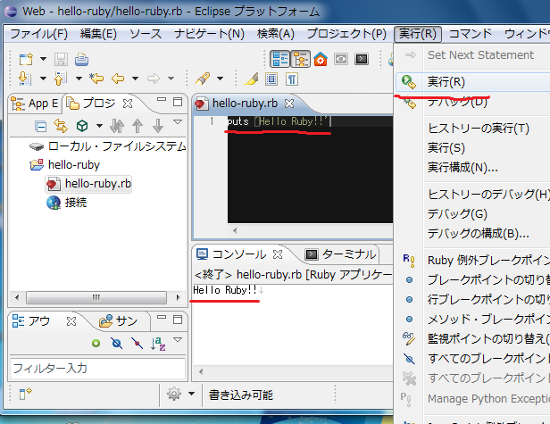

作成したファイルにコードを書き、「実行」ー＞「実行」を選択します。
ウィンドウ下部の"コンソール"に実行結果が表示されます。

---------------

# おわりです... お疲れ様でした!!

